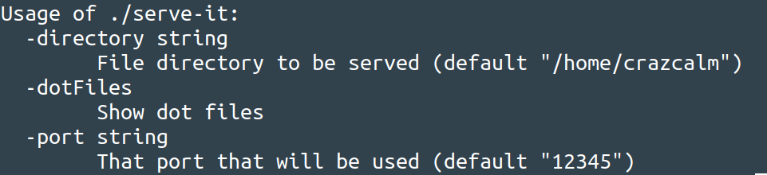

# Serve-It

A command line application that allows you to run a file server on local host that hides dot files.

## Installation
1. `go get github.com/crazcalm/serve-it`
2. cd into that directory and run `go build`

## Usage

